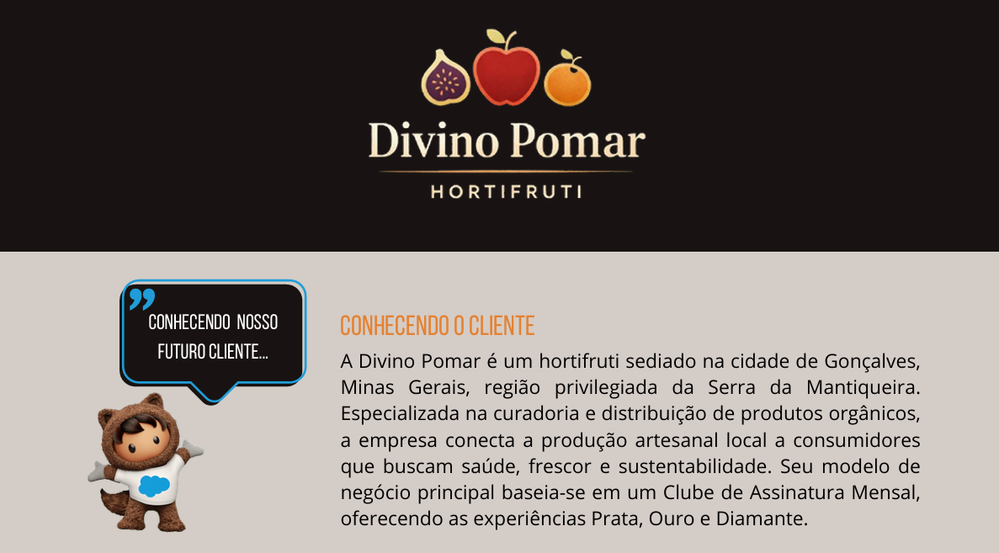
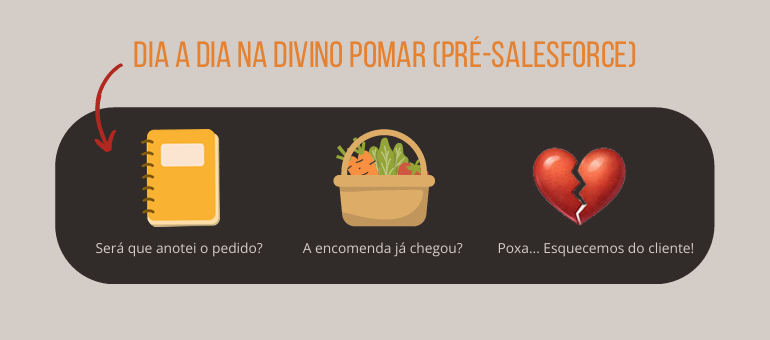
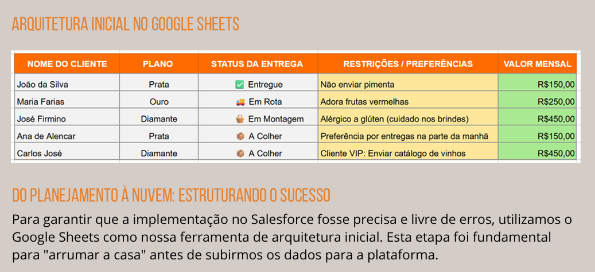
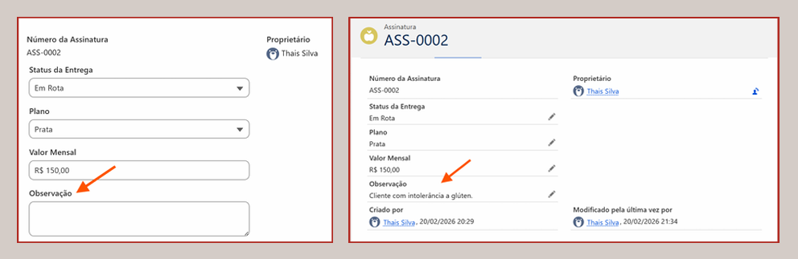
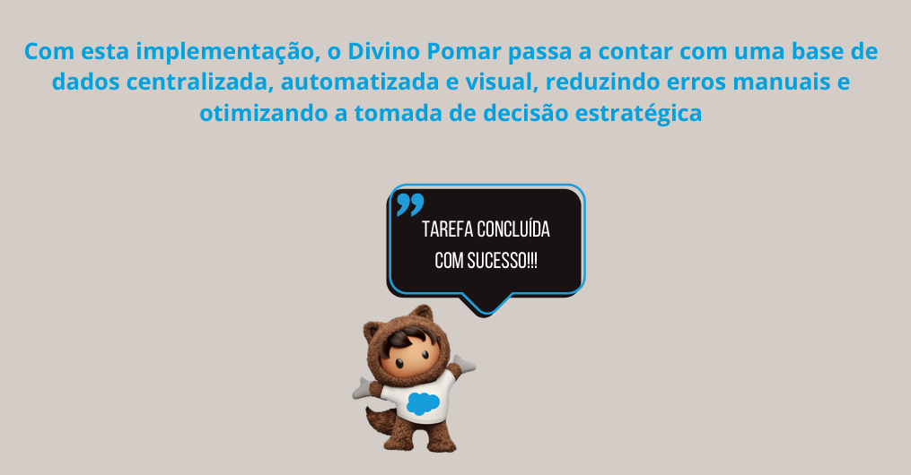

# 🍎 Projeto Divino Pomar: CRM Salesforce 🍎

Este é o segundo projeto da minha trilha de especialização em Salesforce. Após consolidar fundamentos em Excel, SQL e Power BI, sigo me aventurando no universo CRM, aplicando lógica de dados e visão de negócios em soluções de nuvem.
O Divino Pomar é uma marca fictícia que idealizei para este estudo de caso. Localizado na Serra da Mantiqueira (Gonçalves - MG), o hortifruti foca na curadoria de produtos orgânicos.
Este projeto representa a maturação do meu aprendizado L1, saindo de configurações básicas para a estruturação de um modelo de Clube de Assinatura (Prata, Ouro e Diamante), onde a organização da informação é a chave para o sucesso do negócio.

## 🔵 O que foi desenvolvido:
1. Criação da Identidade: Definição de um modelo de negócio artesanal, porém escalável.
2. Transformação Digital: Transição do "caos do papel" para uma plataforma centralizada.
3. Foco em Dados: Aplicação de conhecimentos prévios de Excel e SQL para modelar objetos e campos com precisão técnica.

## 📊 Arquitetura Inicial
Como boa prática de arquitetura, utilizei o Google Sheets como ferramenta de mapeamento antes da implementação. Isso garantiu que a criação dos campos e tipos de dados no Salesforce fosse feita de forma estratégica e sem retrabalho.

## 🛠️ Execução: Do Planejamento à Nuvem (Salesforce em Ação):
Após a estruturação da marca e o desenho da arquitetura no Google Sheets, o projeto avançou para a fase de Build (Construção) dentro do Salesforce Trailhead Playground. O foco foi eliminar o "Caos do Papel" e criar uma interface intuitiva para o utilizador.

1. Modelagem do Objeto "Assinaturas"
* Transformamos a aba do Google Sheets no Objeto Customizado Assinatura__c. Esta é a espinha dorsal do projeto, onde centralizamos:
Identidade Sistêmica: Implementação de Numeração Automática (Formato: ASS-{0000}) para garantir que cada cliente tenha um identificador único, eliminando erros de duplicidade manual.

2. Campos Personalizados:
* Plano__c (Picklist): Segmentação em Prata, Ouro e Diamante.
* Status_da_Entrega__c (Picklist): Padronização do fluxo logístico (A Colher, Em Montagem, Em Rota, Entregue).
* Valor_Mensal__c (Moeda): Precisão financeira para registo de faturamento.
* Observacoes__c (Área de Texto Longo): Onde o toque artesanal é preservado, permitindo registar restrições e preferências alimentares.

3. Gestão Visual e Operacional (Kanban)
* A grande virada de chave para a Divino Pomar foi a ativação da Visualização Kanban.
* Painel de Controle: Saímos de listas estáticas para um quadro dinâmico, onde o gestor arrasta os pedidos conforme avançam na colheita e entrega.
* Resumo de Receita: Configuramos o Kanban para somar automaticamente o Valor Mensal em cada coluna, permitindo uma visão instantânea do faturamento em cada etapa da operação.

4. Interface e Acessibilidade (User Experience)
Para garantir que a equipa utilizasse o sistema com facilidade:
* Guia Personalizada (Tab): Criada com o ícone de Maçã (🍎), facilitando a identificação visual rápida entre as guias padrão do Salesforce.
* Iniciador de Aplicativos: O módulo de Assinaturas foi integrado ao Menu Principal para otimizar o tempo de atendimento e criação de novos registos.

## 🎯 Conclusão e Resultados:
* Com a conclusão deste segundo projeto, a Divino Pomar deixou de ser apenas um hortifruti que "anota pedidos" para se tornar uma comunidade de assinantes gerida com eficiência de uma grande empresa.
* Escalabilidade: O sistema está pronto para suportar o crescimento da base de clientes sem perder a qualidade.
* Decisão Baseada em Dados: O proprietário agora tem relatórios reais para decidir sobre logística e stock.

## 💡 Tecnologias e Ferramentas:
Neste projeto, utilizei um conjunto de ferramentas que conectam o planejamento estratégico à execução técnica em CRM:
* Plataforma de CRM SALESFORCE: Recursos Utilizados: Object Manager, Custom Fields, Kanban Views, Lightning App Builder, Custom Tabs e Data Modeling.
* Planejamento e Arquitetura de Dados -  Google Sheets: Mapeamento de campos, definição de tipos de dados (Picklist, Currency, Long Text) e estruturação da lógica de negócio antes da implementação.
* Stack de Conhecimento (Fundamentos): Diferencial: O domínio prévio de SQL e Power BI facilitou a compreensão da estrutura de objetos relacionais e a importância da integridade dos dados dentro do Salesforce.
👉 [**Clique aqui para visualizar o Relatório Técnico Completo (PDF)**](./pdf/doc_tec_salesforce_divino_pomar.pdf)

## ☁️ Algumas imagens do projeto: 

